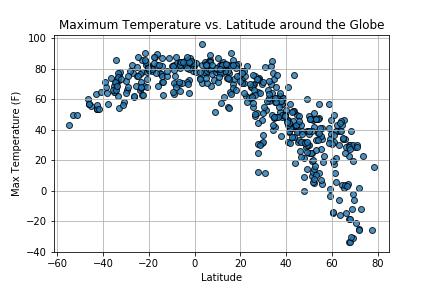
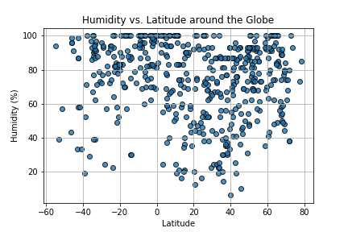
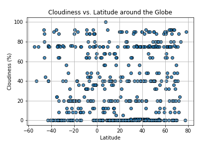
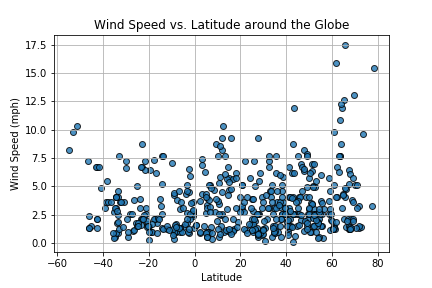

## World Cities Weather
Analyze and capture patterns in global weather data using the Python Citipy package, Matplotlib, and Open Weather Map API (https://openweathermap.org/).  Created a set of approximately 500 random geographical coordinates around the globe, and used Citipy to locate the nearest city to each set of coordinates. Then, retrieved weather information from the Open Weather Map API including cloudiness, humidity level, wind speed, and maximum daily temperature and performed Matplotlib visualizations on this data.

## Temperature vs. Latitude

## Humidity vs. Latitude

## Cloudiness vs. Latitude

## Wind Speed vs. Latitude

## Conclusions

 - Clearly, temperature goes up as you get closer to the equator. The
   temperature data bends in an arc, from 30 degrees Fahrenheit at -60
   degrees latitude to 85 degrees at the equator to 30 degrees at 80
   degrees latitude.
   
 - Wind Speed and Humidity appear normally distributed, with a low wind
   speed and a high humidity being the consistent realities for this
   data set. The global humidity seems to have a median of around 85%,
   and wind speed seems to be a median of around 1.5-2.5%.
   
 - Simply looking at cloudiness versus latitude does not tell us much   
   more than that it appears random: cloudiness may have a relationship 
   with other data (like if it is a coastal or non-coastal city, etc.)  
   but there does not seem to be a relationship with latitude.