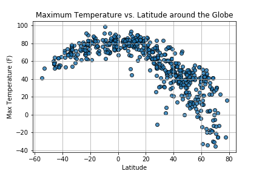

## World Cities Weather
Analyze and capture patterns in global weather data using the Python Citipy package, Matplotlib, and Open Weather Map API (https://openweathermap.org/).  Created a set of approximately 500 random geographical coordinates around the globe, and used Citipy to locate the nearest city to each set of coordinates. Then, retrieved weather information from the Open Weather Map API including cloudiness, humidity level, wind speed, and maximum daily temperature and performed Matplotlib visualizations on this data.

## Temperature vs. Latitude
